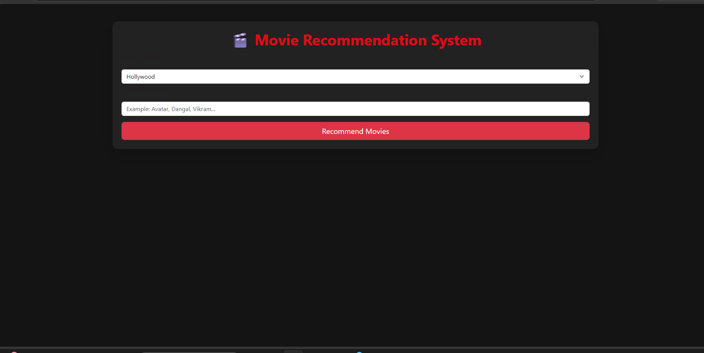
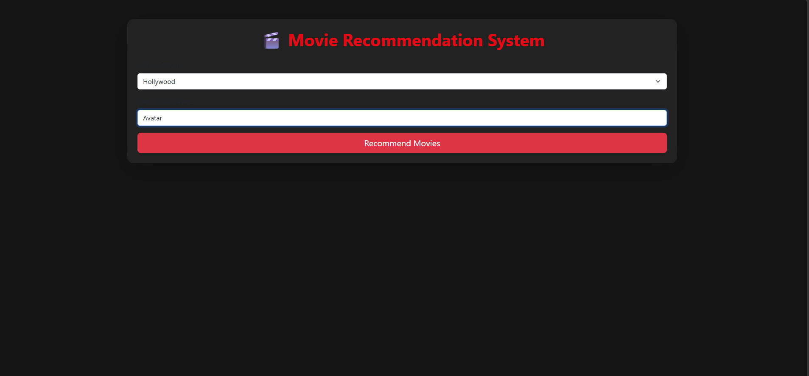
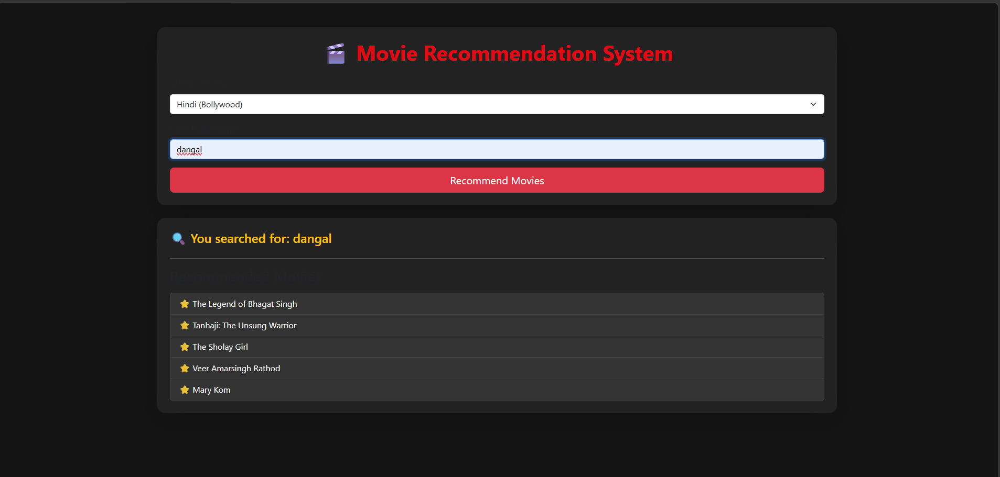
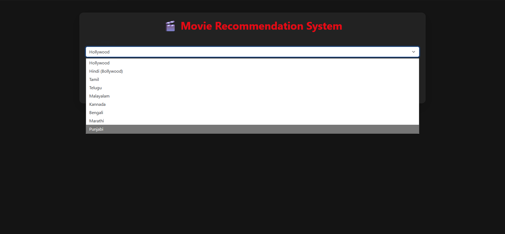

# 🎬 Multi-Language Movie Recommendation System

A web-based Movie Recommendation System built using Python and Flask that provides personalized movie recommendations across multiple film industries including Hollywood, Bollywood (Hindi), Tamil, Telugu, Malayalam, Kannada, Bengali, Marathi, and Punjabi cinema.

## Features

* Content-based movie recommendation
* Hollywood movie recommendations using cosine similarity
* Multi-language Indian movie recommendations
* Modern Netflix-inspired dark UI
* Fast movie search and recommendation generation
* Built with Machine Learning techniques

## Technologies Used

* Python
* Flask
* Pandas
* NumPy
* Scikit-Learn
* Bootstrap 5
* HTML/CSS

## Project Structure

* app.py – Flask application
* templates/ – Frontend HTML templates
* static/ – CSS and assets
* model/ – Recommendation model scripts
* movies.pkl – Hollywood movie dataset
* similarity.pkl – Similarity matrix

# Movie Recommendation System

## 🎥 Demo Video

📥 Download and watch the demo video:

[Demo Video](./screenshot/demo_video.mp4)

## 📸 Screenshots

### Home Page

### Search Functionality

### Recommendations

### Multi-language Support

## Future Enhancements

* Movie poster integration using TMDB API
* Autocomplete search
* User authentication
* Search history
* Personalized recommendations
* Cloud deployment

## Author

Arpita Srivastava
B.Tech CSE (AI & ML)
